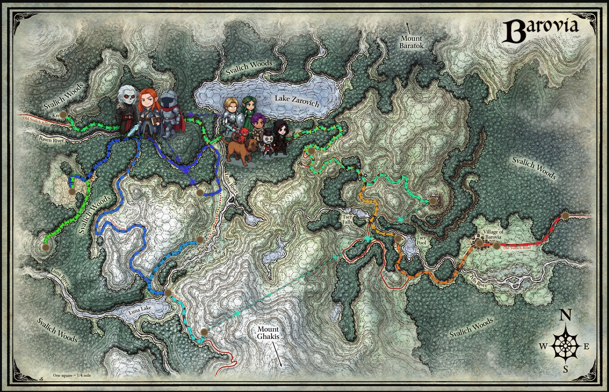

# Curse of Strahd - Campaign Timeline

An interactive map tracking our party's journey through Barovia. Built with Next.js, Leaflet, and React.



## Features

- Interactive map of Barovia with pan and zoom
- Clickable location nodes with story summaries and session details
- Rainbow-colored travel paths showing the party's journey in chronological order
- Winding road paths that follow the actual trails on the map
- Teleportation paths with animated sparkle effects
- Party and ally location indicators
- Side panel with detailed location write-ups and images
- Gothic-themed UI with Cinzel Decorative and Spectral fonts

## Getting Started

```bash
npm install
npm run dev
```

Open [http://localhost:3000](http://localhost:3000) to view the map.

## Project Structure

```
src/
  app/          - Next.js app router, layout, and global styles
  components/   - Map components (nodes, paths, markers, panels, legend)
  hooks/        - Timeline and map control hooks
  lib/          - Coordinate system utilities
  types/        - TypeScript interfaces
public/
  data/         - Timeline JSON data (nodes, paths, campaign info)
  images/       - Map, node thumbnails, character art
```

## Adding Content

- **New locations**: Add a node to `public/data/timeline.json` with coordinates, title, summary, and images
- **New paths**: Add a path entry with `from`/`to` node IDs and optional `waypoints` for winding roads
- **Teleportation**: Set `"style": "teleport"` on a path for the sparkle effect
- **Waypoints**: Use `?edit=true` query param to click the map and log pixel coordinates to the console
